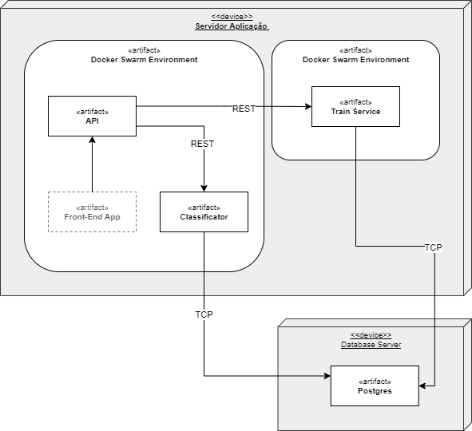

# Classificação de Motos - Teste Gabriel
*Solução realizada por Fernando Lima*


## Modelos

Acesse o [Colab](https://colab.research.google.com/drive/1BgRUQOeEDIZIQhjthGRzfMeLc360SCtM?usp=sharing) para saber sobre a metodoloigia de construção e treinamento dos modelos, técnicas utilizadas e e possíveis reproduções dos passos para chegar nos modelos da demonstração.

## Instruções da Aplicação

Para simular o ssitema distribuído a aplicação foi feita em [Docker](https://docs.docker.com/get-docker), logo é necessário instalar ([nessa página](https://docs.docker.com/get-docker)) o ambiente onde serão inserido os containeres. Certifique-se que o docker etá instalado.


Baixe a aplicação no [repositório do Github](https://github.com/fol21/gabriel-motos-teste-cv). É necessário também fazer  download do modelo pré-treinado.

Para baixar o modelo, acesse o [link para download](https://drive.google.com/uc?export=download&id=1igJR35Io71hX4pNgxcGlfTRGWFqGVXng). O arquivo *model-sample.zip* precisa ser descompactado. Ao descompactar, copie a pasta *model* presente dentro do arquivo compactado e cole na raiz da pasta *classification-service*, asssim a aplicação irá reconhecer o modelo.

### Iniciando a aplicação

Com o docker e docker-compose instalados, basta executar a linha de comando pelo docker-compose essa pasta raiz:

````bash
docker-compose up -d
````

Esse conmando executará os containeries necessários para a demonstração da classificação, com modelos já pré-treinados

### Acessando as rotas

A aplicação inicia, entre outros, um container cotando a API com rotas para acesso da predição das classes de Motos dos modelos além do motor com o modelo de predição. A API f feita utuilzando Typescript, enqunto o motor é uma aplicação em Python/Flask. A rotas disponívels estão listadas:

- [GET]: / : Raiz
- [GET]: /classification :     Vesão do tensorflow utilizada
- [GET]: /classification/description : Descrição das camados do modelo
- [POST]: /classification/predict : Predição das classes

Para realizar a predição, basta enviar uma imagem em base 64 como descrito na requisão  abaixo:

````http

POST http://localhost:3000/classification/predict HTTP/1.1
Content-Type: application/json

{
    "base64": "iVBORw0KGgoAAAANSUhEUgAAAUAAAADgCAIAAAD9mSinAAAgAElEQVR4AbTBabSl51ke6Pt532/ce5..."
}

````

A resposta da requisição retornará um JSON no formato:

````json
{
  "best": "SUZUKI_custom_BOULEVARD-C1500",
  "predictions": {
    "BMW_dual-sport_F-750GS": "0.084813066",
    "BMW_naked_R-NINE": "0.06457235",
    "DAFRA_scooter_MAXSYM": "0.0060819862",
    "GUZZI_naked_V7": "0.03181451",
    "HONDA_dual-sport_CB-500-X": "0.084448434",
    "HONDA_touring_GOLDWING-2": "0.06717247",
    "SUZUKI_custom_BOULEVARD-C1500": "0.33477494",
    "TRIUMPH_naked_STREET-TRIPLE-675R": "0.2911342",
    "TVS_street_sport": "0.030125773",
    "YAMAHA_naked_XSR-700": "0.0050623366"
  }
}
````

## Classificação - Teste 1

Para classificação das imagens, utilizaremos um modelo baseado na [EfficientNet](https://arxiv.org/pdf/1905.11946v5.pdf). Uma arquitetura de rede neural convolucional e um método de dimensionamento que dimensiona uniformemente todas as dimensões de profundidade/largura/resolução usando um coeficiente composto. 

Ao contrário da prática convencional que dimensiona arbitrariamente hiperparâmetros, o método de dimensionamento EfficientNet dimensiona uniformemente a largura, a profundidade e a resolução da rede com um conjunto de coeficientes de dimensionamento fixos. Por exemplo, se quisermos usar vezes mais recursos computacionais, podemos simplesmente aumentar a profundidade da rede , a largura em , e o tamanho da imagem , onde são coeficientes constantes determinados por uma pequena pesquisa de grade no modelo pequeno original. O EfficientNet usa um coeficiente composto para dimensionar uniformemente a largura, a profundidade e a resolução da rede de uma maneira baseada em princípios.

O método de dimensionamento composto é justificado pela intuição de que, se a imagem de entrada for maior, a rede precisa de mais camadas para aumentar o campo receptivo e mais canais para capturar padrões mais refinados na imagem maior.

A rede base EfficientNet-B0 é baseada nos blocos residuais de gargalo invertidos do [MobileNetV2](https://arxiv.org/pdf/1801.04381v4.pdf), além dos blocos squeeze-and-excitation.


## Otimização do modelo - Teste 2

A arquitetura da rede [EfficientNet](https://arxiv.org/pdf/1905.11946v5.pdf) é muito conveniente em termos de escalabilidade, pois nos permite parametrizar os hiperparâmetros. A quantidade de camadas, número e dimensão dos filtros são hiperparâmetros que definem majortariamente a quantidade de operações de ponto flutuante (FLOPS), também define a quantidade de pesos e e o tamnaho do modelo em si.


A rede do EfficientNet a quantidade associada a esses parâmetros fica proporcional aos três parâmetros de escala: largura (l), profundida (w) e dimensões (d). Podemos dimensionar a rede através desses hiperparâmetros.

O impacto dessa escalabilidade pode ser notado no desempenho das variações do EfficientNet B0-7, onde B0 é a base (l,w,d = 1) do modelo, de B1-B7, são redes maiores proporsionais a B0. O Gráfico abaixo mostra a acurácia dos 7 modelos em relação a quantidade de operações:


De B0 a B7 o tamanho do modelo e a quantidade de FLOPS aumenta significantemente, coma vantagem de aprimoarar a acurácia em relação a B0, isso mostra o trade-off entre tamanho-acurácia presente nas Redes Neurais Convolucionais.

Para implementar o modelo em hardwares limitados, não precisamos seguir B0 como base, e sim reduzir a proporção l,w,d para construir modelos menores em escala.


## Infraestrutura - Teste 3

Para realizar a Infraestrtura foi proposta uma arquitetura de sistemas distribuidos. No desenho UML abaix, podemos observar os artefatos presentes necessários para realizar a chamada de detecção. Também encontram-se uma sugestão para a evolução da arquitetura, incluindo agentes para o treinamento do classificador, armazenamento dos resultados e modelos e aplicação Front-End.

***obs:*** *Nessa prova de conceito toda a infra encontra-se dentro de um ambiente docker unificado para fins de demosnração e simplicidade de apresentação do conceito.*




